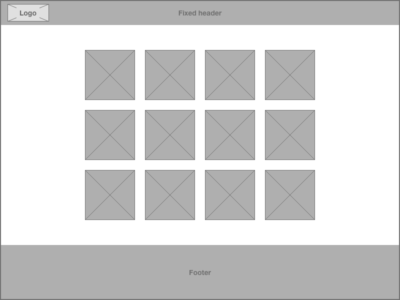
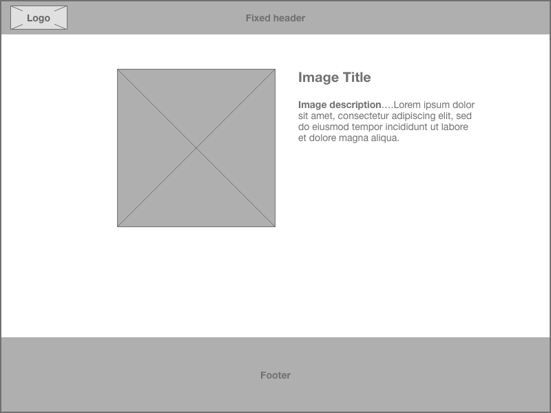

# Art Gallery Website Challenge

We've been asked to create a new website for one of of our art gallery clients. The website will show images of the galleries art and users should be able to read more information about each piece.

The site should be built using the latest best practices, needs to be accessible and should use our API.

Preferably it will be built using React as that is our FE framework of choice at Axiell.

## Wireframes

We have put together a couple of simple wireframes to be used as a guide to what we need to build.

### Homepage Grid

The homepage should show a grid of the gallery images.

### Image Detail

Clicking an image should give a detail view with additional details about the art work displayed alongside a larger.

## Requirements

* The site should be responsive and work well across mobile / tablet / desktop devices
* Accessible

## Bonus Points

Some ideas for additions that could really make your project stand out:

* Pagination
* Image search / filtering / tags
* Routing
* Animations
* An attractive design / finish

Feel free to be creative and add anything you like!

**Important Note** - Your time is precious so please don't spend days and days turning your project into Skynet. If you run out of time / steam, make some notes for us to read about what you would do given more time.

## API

### List all media

http://axielldevtest.eastus2.cloudapp.azure.com:3000/api/media

You can offset the result like so: `/api/media?offset=50`

### Single media item

`/api/media/<id of the media item>`

**Example:**

http://axielldevtest.eastus2.cloudapp.azure.com:3000/api/media/5d5d59ff4431ba89d176b574

## Libraries and frameworks

As previously mentioned, we'd love you to use React as that is our FE framework of choice at Axiell, however we're happy for you to use another framework or vanilla JS should you wish.

Feel free to use [Create React App](https://github.com/facebook/create-react-app), [Bootstrap](https://getbootstrap.com) and any other packages / libraries / tools that you like.

## Delivery

It should be possible to deliver the project as a static site / bundle, so you could zip it up and send it to us but it'd be nice to see your project hosted. Something like [Github Pages](https://pages.github.com/) would be great!

## Assessment

We will assess the task based on the following criteria:

- Code quality (think clean & modular)
- How it looks visually and the techniques used to style the application
- Responsive web design techniques used
- Accessibility
- Any extra bonus bits
